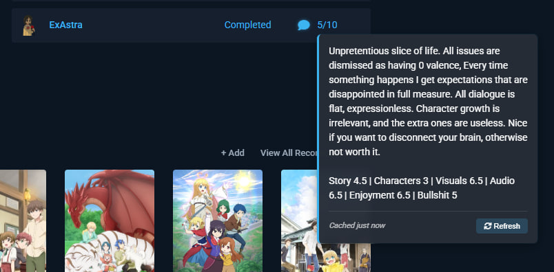

# Anilist Hover Comments

A browser extension that enhances the Anilist experience by displaying user comments when hovering over ratings in the "Following" section of anime pages.

## Features

- 🔍 Shows user comments on hover without needing to visit user profiles
- 💨 Fast performance with comment caching
- 🎯 Only displays comment icons for users who have actually left comments
- 🌈 Smooth animations and visually appealing interface
- 🧠 Smart positioning of tooltips to ensure they stay within viewport

## Installation

### Chrome Web Store
*(Coming soon)*

### Manual Installation
1. Download or clone this repository
2. Open Chrome/Edge and navigate to `chrome://extensions/`
3. Enable "Developer mode" in the top-right corner
4. Click "Load unpacked" and select the extension directory
5. The extension will now be installed and active on Anilist

## Usage

1. Navigate to any anime page on [Anilist](https://anilist.co)
2. Look for comment icons (💬) next to user ratings in the "Following" section
3. Hover over an icon to see the user's comment about that anime

## Technical Details

The extension uses:
- MutationObserver to detect DOM changes
- Debounced event handlers for performance
- Local storage for comment caching
- GraphQL API queries to fetch user comments
- Custom positioning algorithm for tooltips

## Privacy

This extension:
- Only accesses data on anilist.co domains
- Does not collect any user data
- Only stores comments locally for caching purposes
- Makes API requests only to the official Anilist GraphQL endpoint

## Contributing

Contributions are welcome! Please feel free to submit a Pull Request.

1. Fork the repository
2. Create your feature branch (`git checkout -b feature/amazing-feature`)
3. Commit your changes (`git commit -m 'Add some amazing feature'`)
4. Push to the branch (`git push origin feature/amazing-feature`)
5. Open a Pull Request

## License

This project is licensed under the MIT License - see the [LICENSE](LICENSE) file for details.

## Acknowledgments

- Thanks to Anilist for providing a great API
- Icon design by [attribution if applicable]

---

Created with ❤️ for the Anilist community